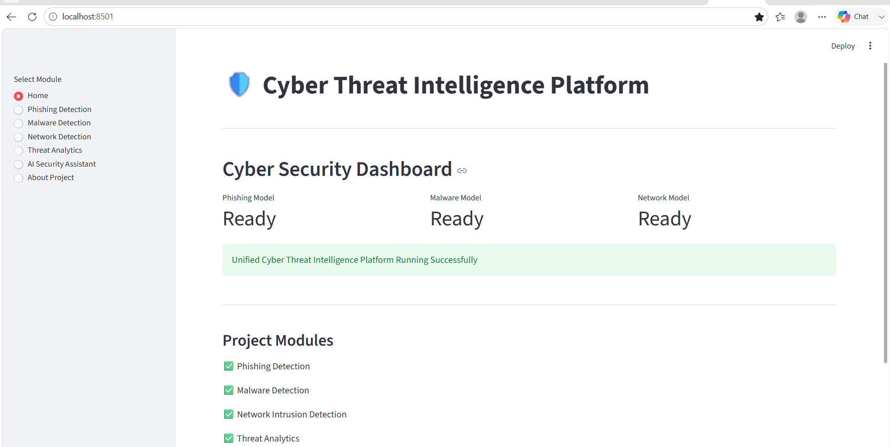
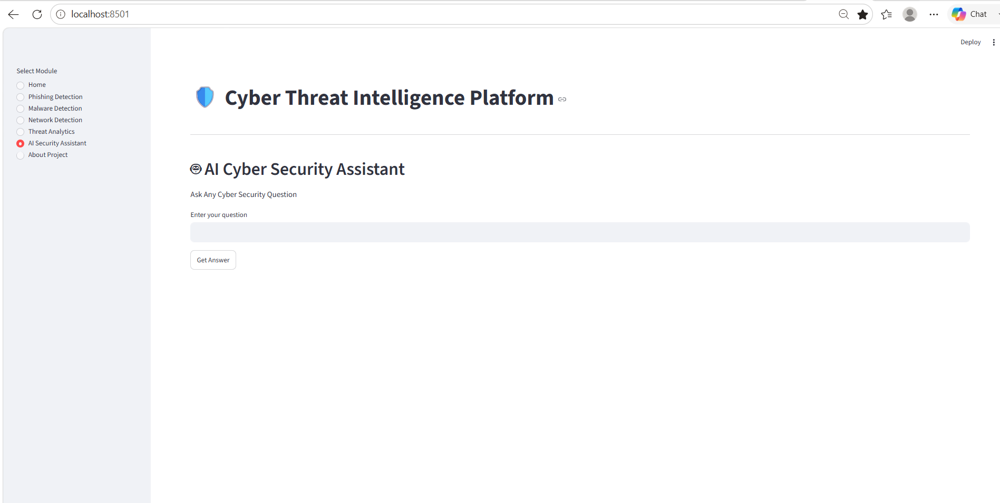

# 🛡️ Cyber Threat Intelligence Platform


---

## 🚀 Project Overview

The **Cyber Threat Intelligence Platform** is an AI-powered cybersecurity solution developed using Machine Learning and Streamlit.

This platform helps identify, analyze, and predict cyber threats through multiple intelligent modules such as phishing detection, malware detection, network intrusion detection, threat analytics, and an AI security assistant.

---

## 📸 Dashboard Preview



---

## 🎯 Project Objectives

* Detect phishing websites using Machine Learning.
* Identify malicious software and malware threats.
* Analyze network traffic and detect intrusion attempts.
* Provide threat analytics and visualization.
* Assist users with cybersecurity-related queries using AI.

---

## ✨ Features

### 🔍 Phishing Detection

* Detects phishing websites.
* Provides confidence score.
* Real-time prediction using trained ML model.

### 🦠 Malware Detection

* Detects malicious files and processes.
* Uses machine learning classification techniques.

### 🌐 Network Intrusion Detection

* Detects:

  * DDoS Attacks
  * DoS Attacks
  * Bot Attacks
  * Port Scanning
  * Normal Traffic

### 📊 Threat Analytics Dashboard

* Visual representation of threats.
* Interactive charts and metrics.
* Threat trend analysis.

### 🤖 AI Security Assistant

* Powered by Gemini AI.
* Answers cybersecurity questions.
* Student-friendly explanations.

---

## 🧠 Machine Learning Algorithms

* Random Forest Classifier
* Data Analytics Techniques
* Classification Models

---

## 🛠️ Technologies Used

### Programming Language

* Python

### Frameworks

* Streamlit

### Libraries

* Pandas
* NumPy
* Scikit-Learn
* Joblib
* Google Gemini AI

### Development Tools

* VS Code
* GitHub

---

## 📁 Project Structure

```text
CyberSecurityProject/
│
├── app.py
│
├── dashboard/
│   └── ai_assistant.py
│
├── datasets/
│   ├── phishing/
│   ├── malware/
│   └── network/
│
├── phishing/
│   ├── phishing_train.py
│   └── phishing_predict.py
│
├── malware/
│   ├── malware_train.py
│   └── malware_predict.py
│
├── network/
│   ├── network_train.py
│   └── network_predict.py
│
├── models/
│   ├── phishing_model.pkl
│   ├── malware_model.pkl
│   └── network_model.pkl
│
├── screenshots/
│   ├── cyber_logo.png
│   ├── dashboard_home.png
│   ├── phishing.png
│   ├── malware.png
│   ├── network.png
│   ├── analytics.png
│   └── ai_assistant.png
│
├── requirements.txt
└── README.md
```

---

## ⚙️ Installation

### Clone Repository

```bash
git clone <repository-url>
cd CyberSecurityProject
```

### Create Virtual Environment

```bash
python -m venv venv
```

### Activate Virtual Environment

Windows:

```bash
venv\Scripts\activate
```

### Install Dependencies

```bash
pip install -r requirements.txt
```

### Run Application

```bash
streamlit run app.py
```

---

## 📊 Screenshots

### Home Dashboard


### Phishing Detection


### Malware Detection


### Network Detection


### Threat Analytics


### AI Security Assistant



---

## 🔒 Cyber Security Capabilities

* Phishing Detection
* Malware Analysis
* Threat Intelligence
* Intrusion Detection
* Security Analytics
* AI-Assisted Cybersecurity Guidance

---

## 📈 Future Enhancements

* Real-time URL Scanning
* File Upload Malware Analysis
* Live Threat Monitoring
* Threat Intelligence Feeds
* Interactive Security Reports
* Advanced AI Chatbot

---

## 👩‍💻 Author

**Laxmi Biradar**

PES University

Cyber Threat Intelligence Platform

---

## 📜 License

This project is developed for educational and research purposes.
